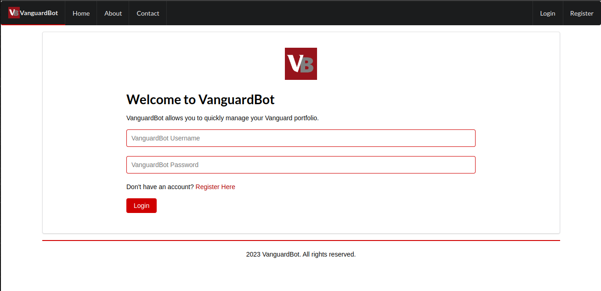

  

# VanguardBot

## About

VanguardBot is a cutting-edge platform designed to revolutionize the way you manage your Vanguard portfolio.

### Features

- **Seamless Tracking**: Effortlessly track your equities in real-time.
- **Trade with Ease**: Buy and sell shares with just a few clicks.
- **Set Stop-Loss Limits**: Protect your investments by setting stop-loss limits.

  

### Security

Our platform is built with security in mind. All your transactions and personal information are kept confidential.

### User-Friendly Interface

With a user-friendly interface, VanguardBot ensures that you stay ahead of the market curve.

### For Everyone

Whether you are a seasoned investor or just starting out, VanguardBot provides all the tools you need to maximize your investments.

## Getting Started

Don't have an account? [Register Here](/register) to begin your journey with VanguardBot.
